# Project Icarus

| Version                                                                | .......Times........             | Recap                                                   | Screenshot                                           |
| ---------------------------------------------------------------------- | -------------------------------- | ------------------------------------------------------- | ---------------------------------------------------- |
| [v0.0.18](https://github.com/hieplchan/projectX/releases/tag/v0.0.18)  | 📅📅😡 15.12–4.1 25       | Happy new year, engine end of life                     | 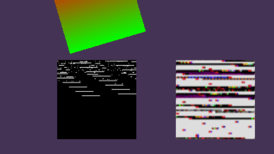  |
| [v0.0.17](https://github.com/hieplchan/projectX/releases/tag/v0.0.17)  | 📅📅 1.12–14.12 25        | Music unlocked!                                         | 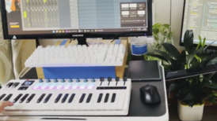  |
| [v0.0.16](https://github.com/hieplchan/projectX/releases/tag/v0.0.16)  | 📅📅😡😡 2.11–30.11 25   | Scene loading from JSON is working!                     | 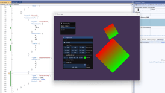  |
| [v0.0.15](https://github.com/hieplchan/projectX/releases/tag/v0.0.15)  | 📅📅😡 13.10–1.11 25      | ImGui reflection work but still not know why 🤔        | 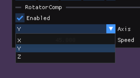  |
| [v0.0.14](https://github.com/hieplchan/projectX/releases/tag/v0.0.14)  | 📅📅😡 22.9–12.10 25      | Test with small RotatorComponent.                       | 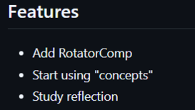   |
| [v0.0.13](https://github.com/hieplchan/projectX/releases/tag/v0.0.13)  | 📅📅 8.9–21.9 25          | Inspector powered by ImGui is alive!                    | 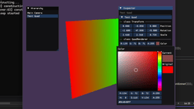   |
| [v0.0.12](https://github.com/hieplchan/projectX/releases/tag/v0.0.12)  | 📅📅 25.8–7.9 25          | Srr, busy playing Silksong rn                           |    |
| [v0.0.11](https://github.com/hieplchan/projectX/releases/tag/v0.0.11)  | 📅📅 11.8–24.8 25         | Nothing visible to show yet, but stay tuned.            | 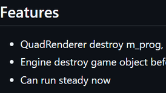   |
| [v0.0.10](https://github.com/hieplchan/projectX/releases/tag/v0.0.10)  | 📅📅 28.7–10.8 25         | Just a quad with custom vertex/fragment                 | 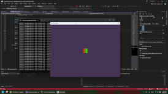   |
| [v0.0.9](https://github.com/hieplchan/projectX/releases/tag/v0.0.9)    | 📅📅 14.7–27.7 25         | 𝐌𝐲 𝐞𝐧𝐠𝐢𝐧𝐞 𝐜𝐚𝐧 𝐬𝐡𝐨𝐰 𝐬𝐨𝐦𝐞𝐭𝐡𝐢𝐧𝐠                         | 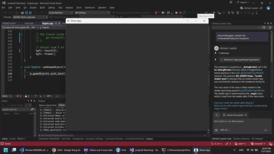     |
| [v0.0.8](https://github.com/hieplchan/projectX/releases/tag/v0.0.8)    | 📅📅 29.6–13.7 25         | Project setup and build: SDL2 & bgfx                    | 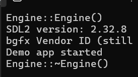     |
| [v0.0.7](https://github.com/hieplchan/pokothegame/releases/tag/v0.0.7) | 📅📅 15.6–28.6 25         | A year since that one post showed me what people liked  | 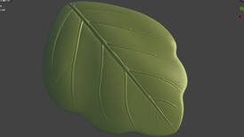     |
| [v0.0.6](https://github.com/hieplchan/pokothegame/releases/tag/v0.0.6) | 📅📅 1.6–14.6 25          | Topology’s still ugly — sorry for your eyes!            |      |
| [v0.0.5](https://github.com/hieplchan/pokothegame/releases/tag/v0.0.5) | 📅📅 18.5–31.5 25         | But still tried adding some slimes, little plants, and ground to my tiny game |      |
| [v0.0.4](https://github.com/hieplchan/pokothegame/releases/tag/v0.0.4) | 📅📅 4.5–17.5 25          | Me ⚔️ Big Dummies.                                     |      |
| [v0.0.3](https://github.com/hieplchan/pokothegame/releases/tag/v0.0.3) | 📅📅 20.4–3.5 25          | Just looting some hero stuff from my dear friend, Link | 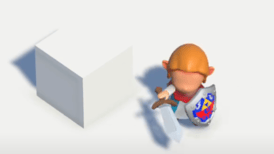     |
| [v0.0.2](https://github.com/hieplchan/pokothegame/releases/tag/v0.0.2) | 📅📅 6.4–19.4 25          | 𝑷𝒐𝒌𝒐 𝒄𝒂𝒏 𝒏𝒐𝒘 𝑴𝑶𝑽𝑬!                                  |      |
| [v0.0.1](https://github.com/hieplchan/pokothegame/releases/tag/v0.0.1) | 📅📅 23.3–5.4 25          | Back to GameDev                                        |      |
| [v0.0.0.2](https://github.com/hieplchan/graveyard_2up_unity_project_lyoko) |  22.10.23 22.3.25      | Project Lyoko (2UP)                                    |      |
| [v0.0.0.1](https://github.com/hieplchan/graveyard_1up_unity_simple_farm) |  30.4-2.6 23             | Unity simple farm (1UP)                                |      |
| [v0.0.0.0](https://play.unity.com/en/user/f6452240-c7ea-44f9-ad8d-8448ed0d0c58) |  26.11 22         | Unity play (0UP)                                       |
